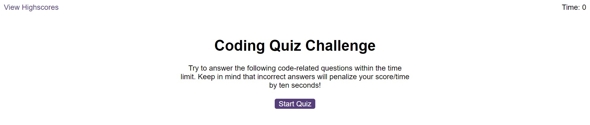

# Coding Quiz Challenge

## Description

This web application allows you to test your knowledge on various front-end web development topics. Keep track of your highscores and make sure you answer before the timer hits 0 or you'll lose.

## Installation

To install this project onto your own computer and review the code, simply clone the repository to a local folder. To view the live deployment of this project on Github pages, [click here](https://tg-ivy.github.io/toms-coding-quiz/).

Here is a screenshot of the live project:

## Credits

edX Front-End Web Development Bootcamp

## License

This repo uses a standard MIT license. For more info on this license, refer to the license file, or [click here](https://choosealicense.com/licenses/mit/).